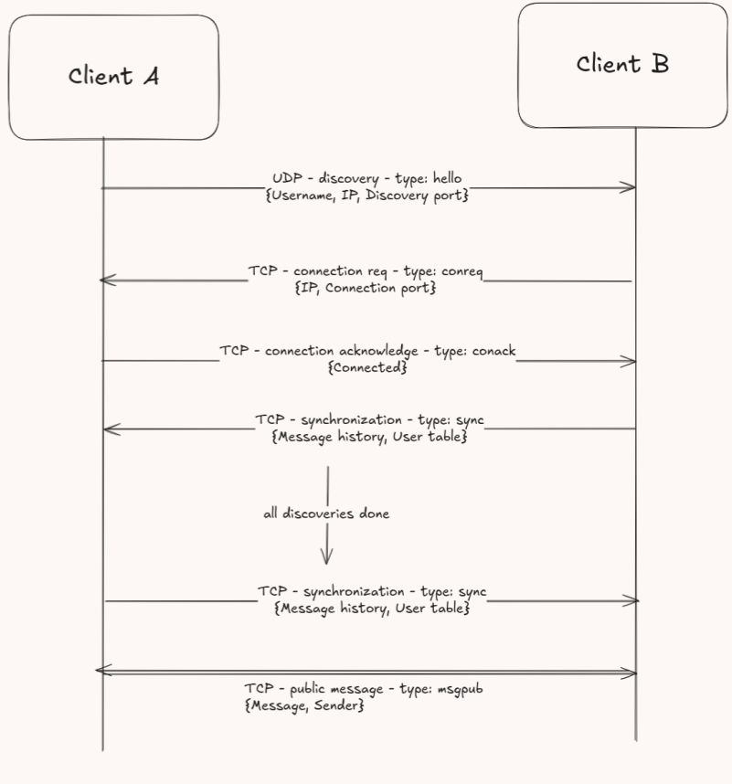
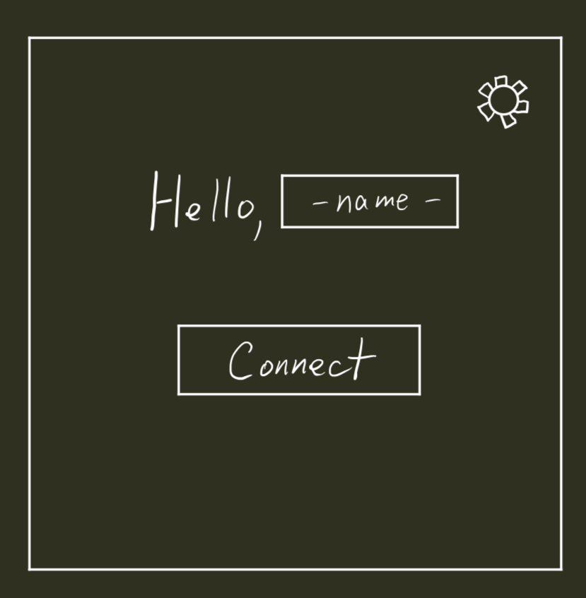
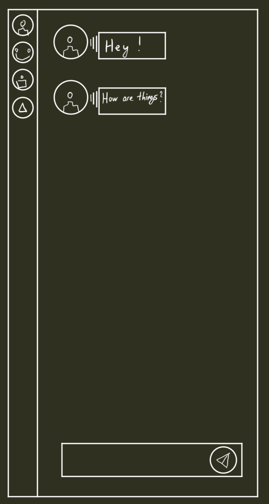

# Network Chat - Project Vision

*Anton Kalašnikov, Constantin Kolomiiets*

## Topic

A program enabling network communication and interactions

## Summary:

The goal of our project is to create an application that allows two or more users to interact over a network without a hub(server).
Clients will communicate with each other via PEER-TO-PEER structure.(Decentralized) 

## Project Description:

### Functionality:

Planned api capabilities:

- Client discovery

- Client connection

- Client synchronization

- Message acceptance in a given format (JSON)

- Message sending in a given format to everyone on the network

- Send private messages to a specific client (we will work on appropriate encryption for sent messages - each client will have its own key)

### Client Characteristics:

The client will be represented by their username, IP address, and corresponding port.

### New client connection vision:

# Client Communication Process

## Overview
This document describes the communication process between two clients in a peer-to-peer network chat system.

## Communication Steps (protocol)

1. **Discovery Phase (UDP)**
   - Client A sends a **Hello** message using UDP.
   - The message includes:
     - `Username`
     - `IP address`
     - `Discovery port`

2. **Connection Request (TCP)**
   - Client B responds with a **Connection Request (conreq)** using TCP.
   - This message contains:
     - `IP address`
     - `Connection port`

3. **Connection Acknowledgment (TCP)**
   - Client A acknowledges the request by sending a **Connection Acknowledge (conack)** message via TCP.
   - This confirms that Client A has successfully established the connection.
   - The message contains:
     - `Connected` status

4. **Synchronization (TCP)**
   - Client B sends a **Synchronization (sync)** message.
   - This message includes:
     - `Message history`
     - `User table` (list of connected users)

5. **Final Synchronization (TCP)**
   - After completing the discovery process, another **sync message** is sent.
   - This ensures that both clients are fully synchronized.
   - The message contains:
     - `Message history`
     - `User table`

6. **Public Messaging (TCP)**
   - Once synchronized, clients can send **public messages**.
   - The message type is **msgpub**.
   - This message includes:
     - `Message content`
     - `Sender information`

7. When a client disconnects, a Bye message type is sent. It is then relayed to every other connection

## Message History

- Each message record contains not only the content of the message but also the timestamp and the sender's information. Only user-sent messages are stored (system messages such as Hello, Connection, etc., are not stored).

- Each client stores the entire message history (public) until they disconnect. The message history between two users will be preserved as long as at least one of them remains connected.

## UI

- Upon launch, the user will be greeted with a page featuring a form and an input field where they can enter their username.

- By clicking the Settings button, users can access advanced settings, such as changing the port.

- After clicking the Connect button, a new page with a public chat will open, displaying a sidebar with a list of active clients (their usernames). Clicking on a username will open a private conversation with that user.

- The basic elements of our interface will be similar to the Chat interface in Microsoft Teams or Discord.

